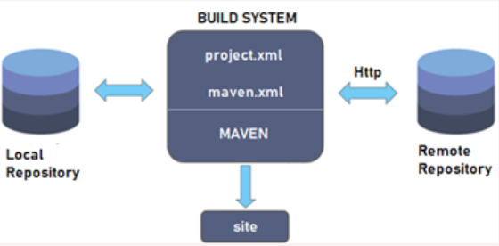
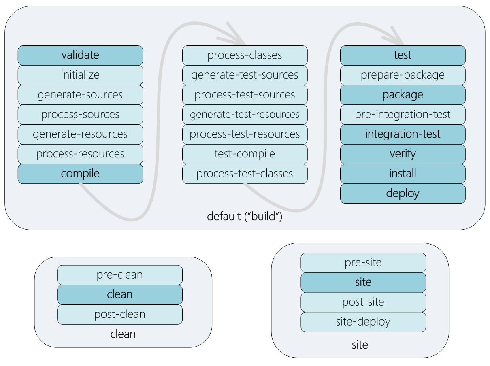
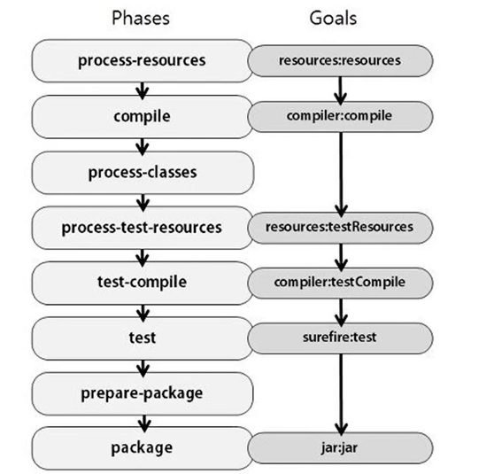

# Maven

## Why we need Maven?
If you have a huge number of dependencies, then you have to download these manually.
This takes a lot of time.
Now maven helps you by letting you editing the dependencies inside pom.
XML file of maven and maven will automatically download it for you. Also, even if you 
want to upgrade the version of software you use in the project, you only have to change 
the version of dependency in the pom.xml and maven will download it automatically.

## What is Maven?
It is a build automation tool that is primarily used for Java based project. 
It describes how the project is built, and what are the dependencies. A XML file describes 
the software project that being built, the dependencies, build order and required plugins.
Maven dynamically downloads the Java libraries and the Maven plugins and save it into your 
local repository.

## Maven Architecture
When you specify a dependency in pom.xml maven will look for it in the central repository,
if it does not exist in the central repository then maven will fetch it from the remote 
repository so using the internet while using Maven is mandatory.


**Figure 1: Maven Architecture (Source: [1])**

## Maven Lifecycle


**Figure 2 Maven Phases (src: [2])**

Default Lifecycle is responsible for the projet deployment.
Clean Lifecycle Used to clean the project and remove all files made by the previous build.
Site Lifecycle To create  a project’s site documentation.
Maven Phases and goals
Maven’s build lifecycle goes through a set of stages, they are called build phases.A build phase is made up of a set of goals. Maven goals represent a specific task that contributes to the building and managing of a project.


**Figure 3 Maven Phases and goals (src: [3])**

A phase is a step in the lifecycle, and each phase contains goals which are tasks.
When you run a phase you are executing the goals related to it in order. 
For example compiler:compile is executed during the compile phase.

# Demo

## Creating a Maven Project

Create a Maven project using IntelliJ IDEA:

1. Open IntelliJ IDEA.
2. Select **New Project**.
3. Choose **Maven**.
4. Configure:
    - Group ID
    - Artifact ID
    - Java version
5. Create the project.

## Adding Dependencies
Dependencies are added inside the `pom.xml` file.

Example:
```xml
    <dependency>
        <groupId>com.fasterxml.jackson.core</groupId>
        <artifactId>jackson-databind</artifactId>
        <version>2.22.1</version>
    </dependency>
```
After adding the dependency maven will automatically download the library

## Useful Maven Commands

<table>
  <tr>
    <th>Command</th>
    <th>Description</th>
  </tr>
  <tr>
    <td><code>mvn validate</code></td>
    <td>Validates the project configuration</td>
  </tr>
  <tr>
    <td><code>mvn compile</code></td>
    <td>Compiles the source code</td>
  </tr>
  <tr>
    <td><code>mvn test</code></td>
    <td>Runs unit tests</td>
  </tr>
  <tr>
    <td><code>mvn package</code></td>
    <td>Creates the project package (JAR/WAR)</td>
  </tr>
  <tr>
    <td><code>mvn clean</code></td>
    <td>Removes generated build files</td>
  </tr>
  <tr>
    <td><code>mvn install</code></td>
    <td>Installs the package into the local repository</td>
  </tr>
  <tr>
    <td><code>mvn deploy</code></td>
    <td>Deploys the package to a remote repository</td>
  </tr>
  <tr>
    <td><code>mvn site</code></td>
    <td>Generates project documentation website</td>
  </tr>
</table>


## References

[1] All about Maven - Java Interview Preparation - Java Door  
[2] What are Maven goals and phases and what is their difference? - Stack Overflow  
[3] Maven tutorial | Maven for building Java Applications | Edureka